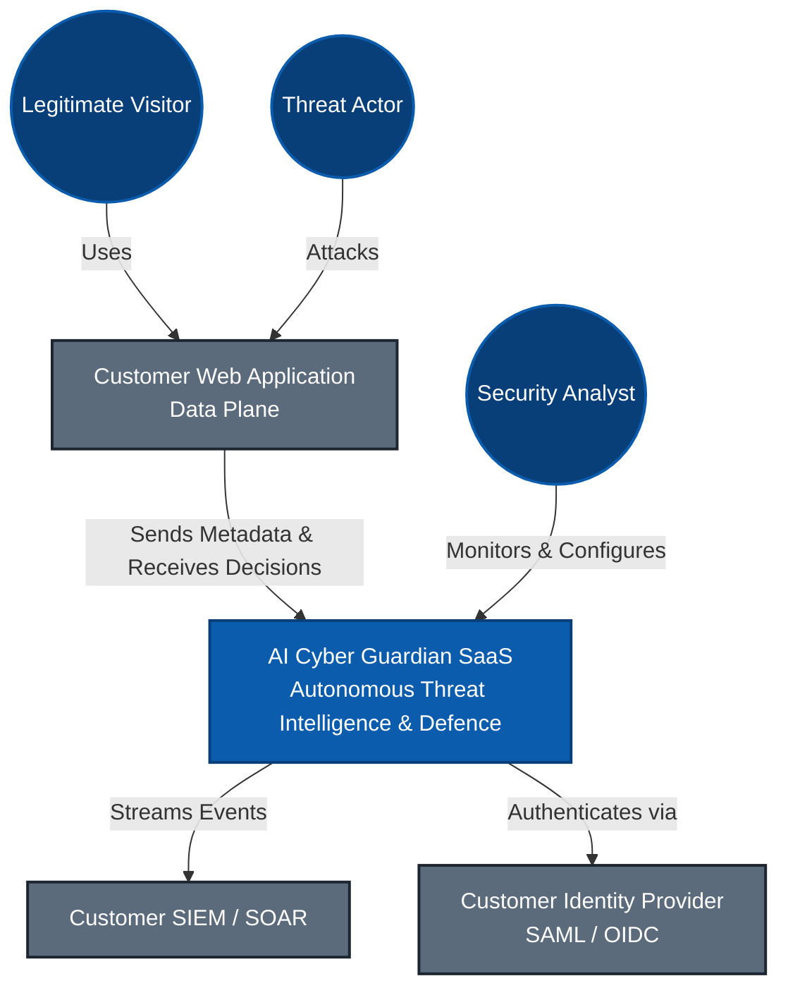
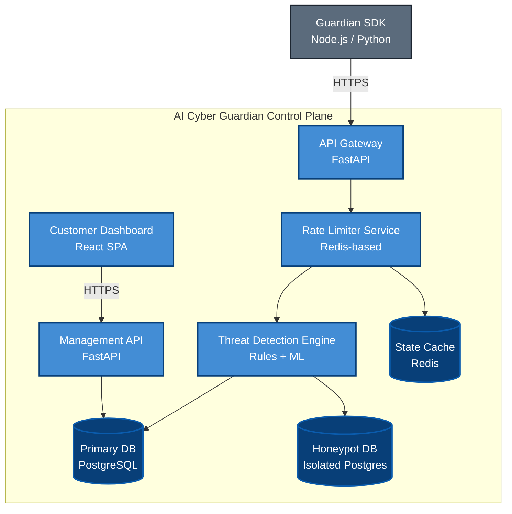
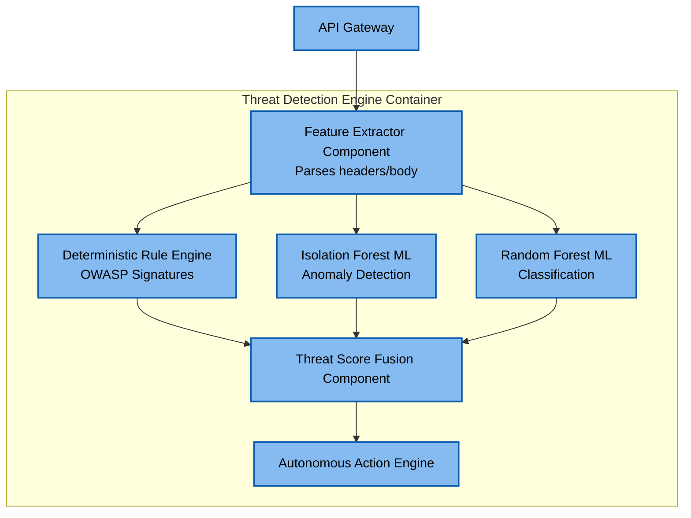
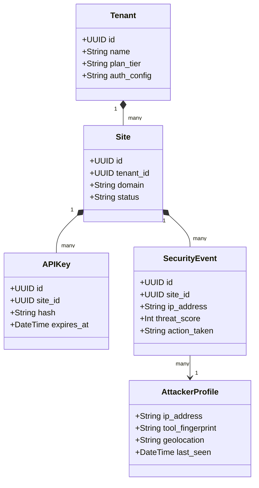
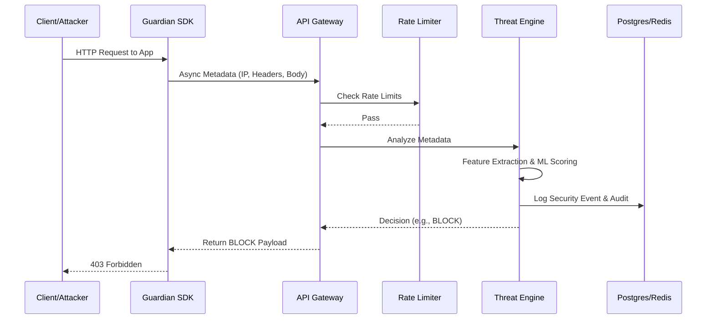
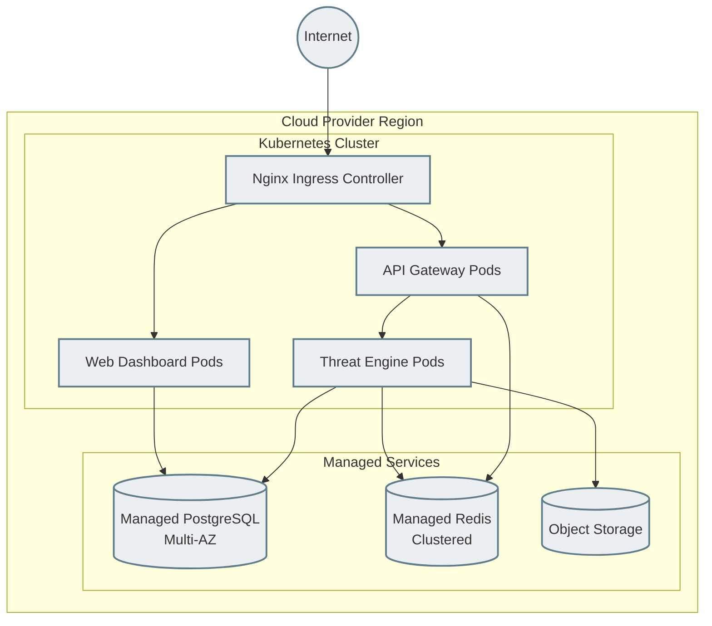
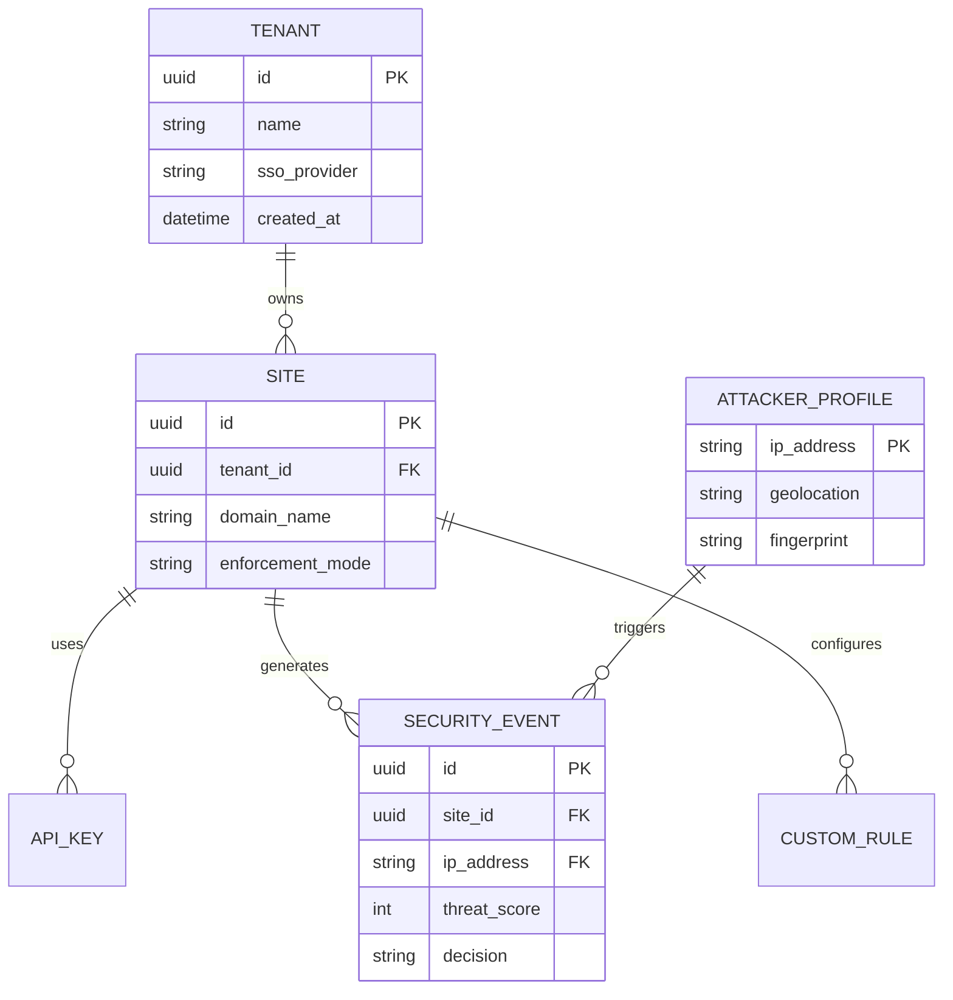
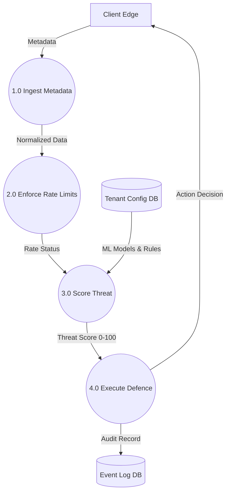
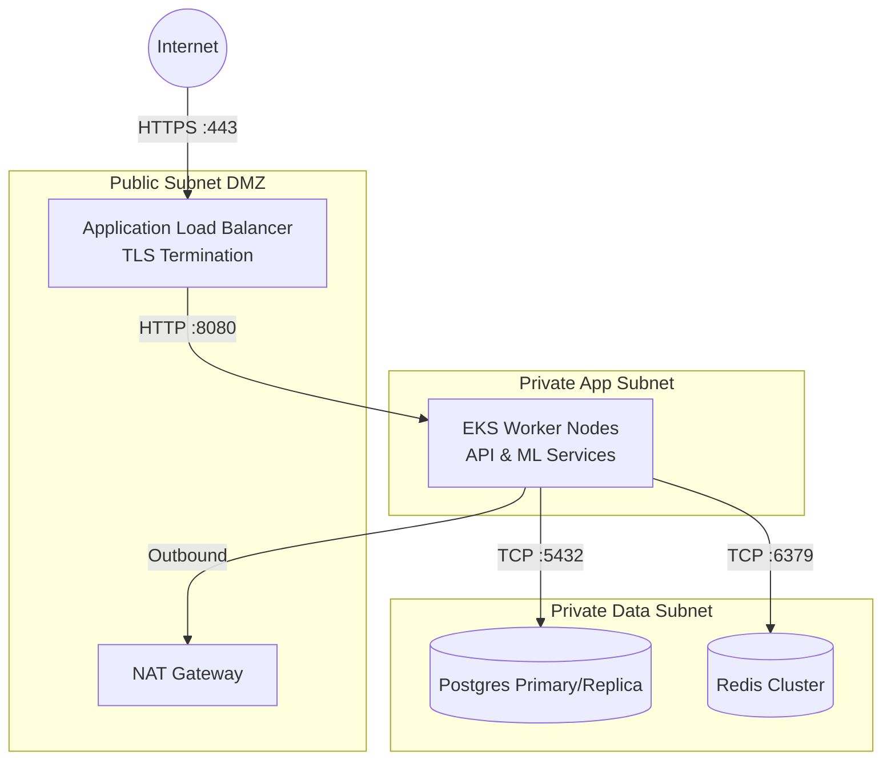

# AI Cyber Guardian: Comprehensive Architecture Diagrams

## 1. C4 System Context Diagram

## 2. C4 Container Diagram

## 3. C4 Component Diagram (Deep Analysis Stage)

## 4. UML Class Diagram

## 5. Sequence Diagram

## 6. Deployment Diagram

## 7. Entity Relationship (ER) Diagram

## 8. Data Flow Diagram (DFD)

## 9. Network Architecture Diagram

